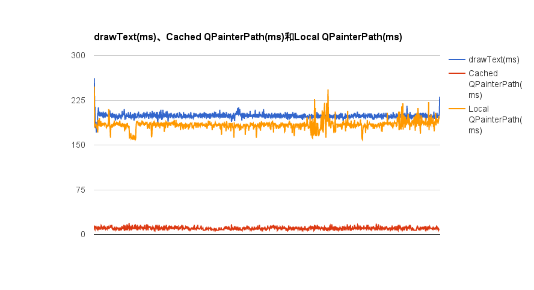

# Qt-drawText-profiling

## Abstract ##
This application is for text drawing profiling in Qt, it records time for different text drawing strategy:

1. Use `QPainter::drawText` directly.
2. Use `QPainter::drawPath` with prepared `QPainterPath`.
3. Similar to 2., but `QPainterPath` is created while painting.

## Result
My own test result

Test environment and data are [here](https://docs.google.com/spreadsheets/d/1xH02vvbJoFtv9J9uHW4Ikqos2-kaC6MDrfCkcKZh4Hs/edit?usp=sharing)
